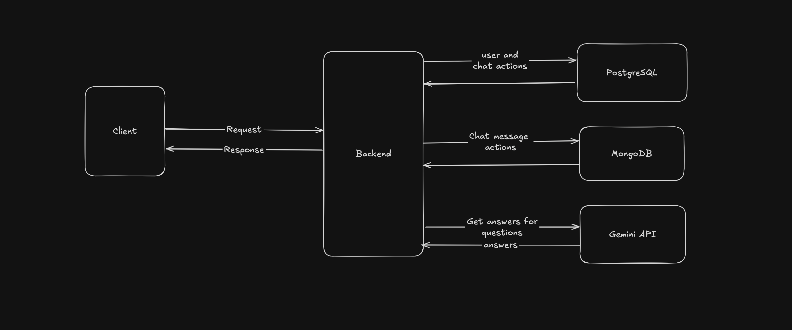
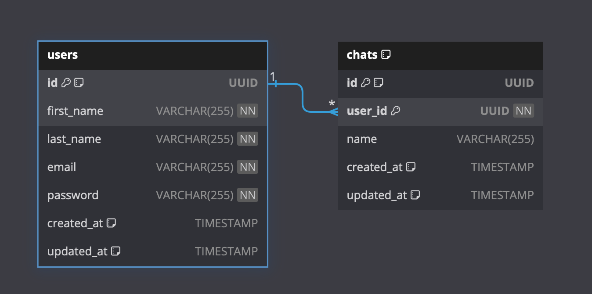

# Hukuk Chatbot Projesi

Bu proje, hukuk öğrencilerinin ve avukatların kolayca bilgilere ulaşmasını sağlayan bir chatbot uygulamasıdır. Frontend kısmında Next.js, backend kısmında ise Go kullanılmıştır.

## Teknolojiler

- **Frontend:** Next.js, React
- **Backend:** Go
- **Veritabanı:** PostgreSQL, MongoDB
- **Api:** Gemini Api
- **Diğer:** Docker, Turbo Repo, Husky

## Sistem Tasarımı

### Genel Mimari



### Frontend Tasarımı

Frontend kısmı, kullanıcıların chatbot ile etkileşime geçmesini sağlayan arayüzü sağlar. Next.js ve React kullanılarak geliştirilmiştir. Kullanıcıların sorularını girebileceği ve cevapları görüntüleyebileceği bir arayüz sunar. Ayrıca, kullanıcı oturumlarını yönetmek ve kullanıcı deneyimini iyileştirmek için çeşitli bileşenler ve kütüphaneler kullanılmıştır.

### Backend Tasarımı

Backend kısmı, chatbotun iş mantığını ve veri yönetimini sağlar. Go dilinde geliştirilmiştir ve aşağıdaki bileşenleri içerir:

- **API Katmanı:** Kullanıcı isteklerini alır ve iş mantığı katmanına yönlendirir.
- **İş Mantığı Katmanı:** Kullanıcı isteklerini işler, gerekli veritabanı sorgularını yapar ve sonuçları API katmanına geri döner.
- **Veritabanı Katmanı:** PostgreSQL ve MongoDB ile etkileşime geçer. İlişkisel veriler PostgreSQL'de, yapılandırılmamış veriler MongoDB'de saklanır.

### Database Tasarımı

#### PostgreSQL
PostgreSQL, ilişkisel veritabanı yönetim sistemi olarak kullanılmıştır. Kullanıcı bilgileri, chat geçmişi gibi ilişkisel verilerin saklanması ve yönetilmesi için idealdir. Ayrıca, güçlü sorgulama yetenekleri ve veri bütünlüğü sağlama özellikleri nedeniyle tercih edilmiştir.



#### MongoDB
MongoDB, belge tabanlı bir NoSQL veritabanıdır. Chatbot mesajları gibi yapılandırılmamış veya yarı yapılandırılmış verilerin hızlı bir şekilde saklanması ve erişilmesi için kullanılmıştır. Esnek veri modeli ve yüksek performansı nedeniyle tercih edilmiştir.

```
    {
        _id:"",
        chatid:"",
        userid:"",
        message:"",
        category:"",
        aimodel:""
    }
```

## Kurulum

1. Frontend dizinine gidin:
   ```bash
   cd apps/frontend
   ```
2. Gerekli paketleri yükleyin:
   ```bash
   npm install
   ```
3. Backend dizinine gidin:
   ```bash
   cd apps/backend
   ```
4. Gerekli paketleri yükleyin:
   ```bash
   go mod tidy
   ```
5. Uygulamayı başlatın:
   ```bash
   cd ../../
   npm run dev
   ```

## Kullanım

1. Frontend ve backend sunucularını başlattıktan sonra, tarayıcınızda `http://localhost:3000` adresine gidin.
2. Chatbot arayüzü üzerinden sorularınızı sorarak bilgi alabilirsiniz.

## Katkıda Bulunma

Katkıda bulunmak isterseniz, lütfen bir pull request gönderin veya bir issue açın.

## Lisans

Bu proje MIT Lisansı ile lisanslanmıştır.
